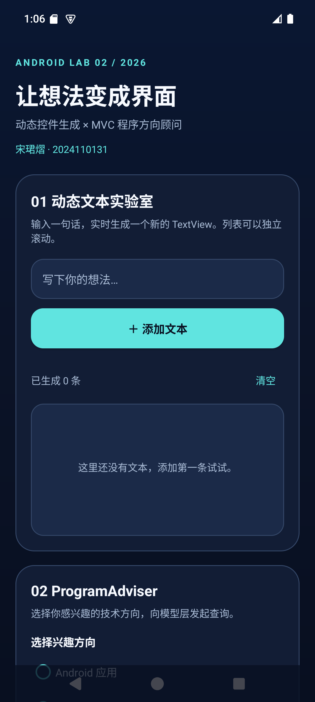
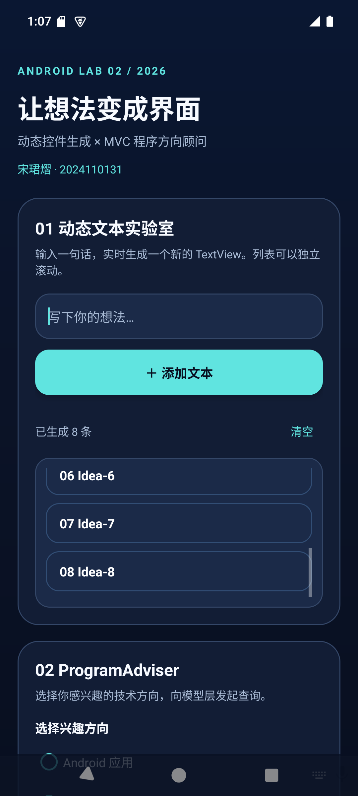
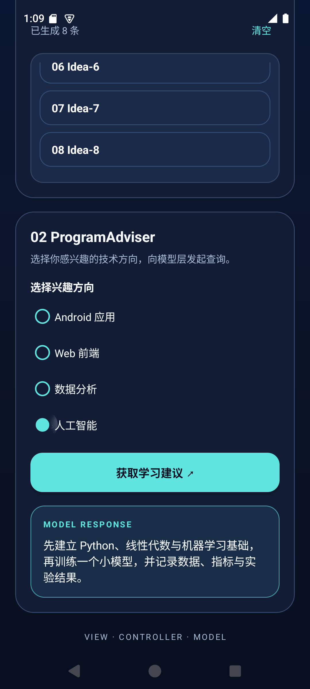

# 实验二：UI 控件代码生成以及 MVC

Android Studio 工程，作者：宋珺熠（2024110131）。应用标题为“宋珺熠2024110131”。

## 功能

- 区域 01：输入文本后用 Kotlin 动态创建 `TextView`，添加到 `ScrollView` 内的 `LinearLayout`；支持清空和数量统计。
- 区域 02：交互式 ProgramAdviser。选择 Android、Web、数据分析或人工智能方向后，控制器查询独立的 `ProgramAdviserModel`，显示对应学习建议。
- 使用 ViewBinding 访问控件。界面文案和建议内容均在 `res/values/strings.xml` 中，无布局或 Kotlin 代码里的硬编码文案。
- 深色科技风界面与定制代码符号应用图标。

## MVC 对应关系

| 层 | 实现 |
| --- | --- |
| View | `app/src/main/res/layout/activity_main.xml`、`strings.xml` 等资源 |
| Controller | `MainActivity.kt`，处理添加、清空、单选与查询事件 |
| Model | `ProgramAdviserModel.kt`，根据方向返回对应建议的资源 ID |

## 运行

1. 在 Android Studio 中打开本目录，等待 Gradle 同步。
2. 选择 Android API 23 及以上模拟器或真机，运行 `app`。
3. Debug 构建：`gradlew.bat :app:assembleDebug`。
4. 单元测试：`gradlew.bat :app:testDebugUnitTest`。若 Windows 工程路径包含中文、测试任务无法加载测试类，可通过 ASCII 路径映射运行（例如 `subst X: <项目绝对路径>` 后从 `X:\` 执行）。

## 实际验证

已在 Android API 35 模拟器安装并启动；验证新增 8 条文本后的独立滚动、未选方向提示，以及人工智能方向的模型返回。`report-assets` 中是这些步骤的真实运行截图。

